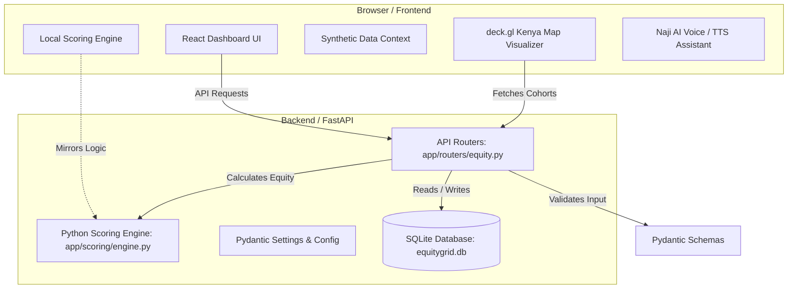
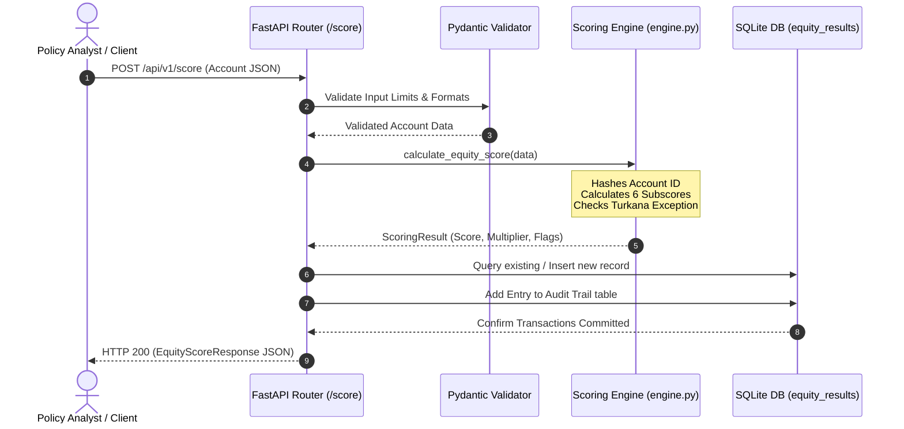
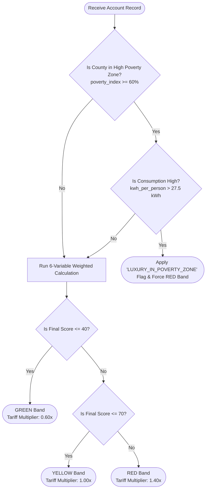

# EquityGrid Kenya — System Design & Architecture Spec

This specification documents the system architecture, database models, scoring engine design, and security guidelines for **EquityGrid Kenya**.

---

## 1. System Architecture

EquityGrid Kenya is built as a unified, monolithic application to simplify deployment and maintenance. It consists of a React single-page application (SPA) on the frontend, served and backed by a Python FastAPI server.



### End-to-End Scoring Data Flow


---

## 2. Scoring Engine Design (Six-Variable Model)

The scoring engine calculates a weighted equity score (0–100) indicating household affluence or cross-subsidy risk. Higher scores represent higher affluence (RED band); lower scores indicate vulnerability (GREEN band).

### Targeting & Exception Decision Tree


### Variables and Weights

| Variable | Weight | Description | Scoring Formula / Logic |
|---|---|---|---|
| **1. Consumption per capita** | 25% | Monthly kWh divided by ward household size. | Score scaled relative to a national baseline benchmark of 22 kWh per person. |
| **2. Payment consistency** | 22% | Average monthly disconnection days. | `Score = clamp(100 - (disconnection_days * 15))` |
| **3. NSPS registration status** | 18% | Verified social protection registration. | `0.0` if registered (highly vulnerable); otherwise mapped between `50` and `100` based on county NSPS coverage rate. |
| **4. Peak demand ratio** | 15% | Share of energy consumed during peak (6pm–10pm). | `Score = clamp(100 - (peak_demand_ratio * 120))` |
| **5. Upgrade history** | 12% | Meter/Connection phase and kVA capacity. | `100` for three-phase connections; `70` for single-phase connections > 5 kVA; `10` for standard connections. |
| **6. Active accounts** | 8% | Number of active meters at same address. | `100` for 3+ meters (landlord/estate pattern); `60` for 2 meters; `0` for a single meter. |

### Classification Bands

*   🟢 **GREEN (Score ≤ 40):** Protected Lifeline tariff band. Mapped to a suggested **0.60×** tariff multiplier.
*   🟡 **YELLOW (Score ≤ 70):** Standard Retail tariff band. Mapped to a suggested **1.00×** tariff multiplier.
*   🔴 **RED (Score > 70):** Cross-Subsidy Contributor band. Mapped to a suggested **1.40×** tariff multiplier.

### Exceptions
*   **The Turkana Exception:** Any household residing in a high-priority / high-poverty zone (e.g. Turkana) with high-draw consumption patterns (such as peak load indicating luxury appliance use) is automatically overridden to **RED** to prevent subsidy leakage.

---

## 3. Database Schema

The SQLite schema consists of two primary models:

### 3.1 `equity_results`
Stores variables, computed subscores, and resulting classifications for each household.

```sql
CREATE TABLE equity_results (
    id INTEGER PRIMARY KEY AUTOINCREMENT,
    account_id_hash VARCHAR(64) UNIQUE NOT NULL,
    county VARCHAR(80) NOT NULL,
    ward_avg_household_size FLOAT NOT NULL,
    kwh_month FLOAT NOT NULL,
    avg_disconnection_days_per_month FLOAT NOT NULL,
    nsps_registered BOOLEAN NOT NULL DEFAULT 0,
    county_nsps_coverage_rate FLOAT NOT NULL,
    peak_demand_ratio FLOAT NOT NULL,
    has_three_phase BOOLEAN NOT NULL DEFAULT 0,
    connection_capacity_kva FLOAT NOT NULL,
    accounts_same_address INTEGER NOT NULL DEFAULT 1,
    urban_rural_classification VARCHAR(24) NOT NULL DEFAULT 'Rural',
    score_consumption_per_capita FLOAT NOT NULL,
    score_payment_consistency FLOAT NOT NULL,
    score_nsps_status FLOAT NOT NULL,
    score_peak_demand_ratio FLOAT NOT NULL,
    score_upgrade_history FLOAT NOT NULL,
    score_active_accounts FLOAT NOT NULL,
    equity_score FLOAT NOT NULL,
    classification VARCHAR(10) NOT NULL, -- GREEN, YELLOW, RED
    suggested_tariff_multiplier FLOAT NOT NULL,
    flags TEXT DEFAULT '',               -- JSON list of active flags
    created_at DATETIME NOT NULL
);
```

### 3.2 `audit_trail`
An immutable log tracking all calculations and adjustments.
```sql
CREATE TABLE audit_trail (
    id INTEGER PRIMARY KEY AUTOINCREMENT,
    account_id_hash VARCHAR(64) NOT NULL,
    action VARCHAR(50) NOT NULL,          -- e.g. SCORE_CALCULATED, RECLASSIFIED
    details TEXT DEFAULT '',              -- JSON formatted change details
    timestamp DATETIME NOT NULL
);
```

---

## 4. API Spec (REST Endpoints)

| Method | Endpoint | Request Payload | Response Model | Description |
|---|---|---|---|---|
| `POST` | `/api/v1/score` | `AccountInput` | `EquityScoreResponse` | Scores and persists a single household. |
| `POST` | `/api/v1/score/batch` | `BatchScoreRequest` | `BatchScoreResponse` | Scores a list of households in batch. |
| `GET` | `/api/v1/results` | Query Parameters (page, per_page, classification, county) | `PaginatedResults` | Queries paginated household results. |
| `GET` | `/api/v1/results/{account_hash}` | Path Parameter (`account_hash`) | `ResultRecord` | Retrieves a single household scorecard. |
| `GET` | `/api/v1/stats` | None | `StatsResponse` | Returns dashboard KPIs and anomaly aggregates. |
| `GET` | `/api/v1/health` | None | `HealthResponse` | Verifies app and database connection status. |

---

## 5. Security & Privacy Controls

*   **Hashed Identifier Protection:** To comply with data privacy policies, raw customer account IDs are never written to the database or exposed via the REST API. They are irreversibly hashed using **SHA-256** on input.
*   **Geospatial Obfuscation:** Raw GPS coordinates (Latitude/Longitude) are utilized only in memory to classify urban/rural locations and look up ward-level boundaries. In audit records, coordinates are hashed using a server-side secret seed (`GEOSPATIAL_LAYER_PEPPER`).
