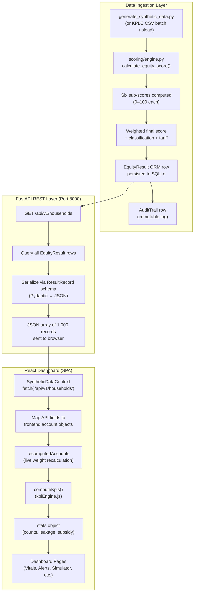
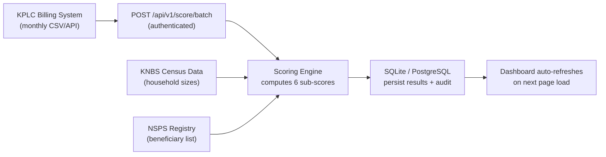

# EquityGrid Kenya — Data Flow & EPRA Value Proposition

---

## 1. End-to-End Data Flow: Database → API → Dashboard UI

The diagram below traces exactly how a single household record moves from the SQLite database all the way to a pixel on the regulator's screen.



---

## 2. Layer-by-Layer Walkthrough

### Layer 1 — Data Ingestion & Scoring Engine

| File | Role |
|------|------|
| [`generate_synthetic_data.py`](file:///Users/app/Desktop/EquityGridKenya/scripts/generate_synthetic_data.py) | Seeds 1,000 demographically realistic household records across 47 Kenyan counties with weighted sampling (Nairobi 300, Mombasa 120, etc.). Called automatically on first boot if the database is empty. |
| [`scoring/engine.py`](file:///Users/app/Desktop/EquityGridKenya/app/scoring/engine.py) | The core **six-variable model**. For each account, it computes six sub-scores (0–100), applies configurable weights, sums them into a final equity score, and classifies the account. |

**The six scored variables and their default weights:**

| # | Variable | Weight | What it measures |
|---|----------|--------|------------------|
| 1 | Consumption per capita proxy | **25%** | `kWh/month ÷ ward_avg_household_size` benchmarked against 22 kWh national capita |
| 2 | Payment consistency | **22%** | Inverse of average disconnection days per month (fewer disconnections → higher affluence signal) |
| 3 | NSPS registration status | **18%** | Whether the household is a verified National Safety Net Programme beneficiary (registered = 0 score) |
| 4 | Peak demand ratio | **15%** | Share of consumption in the 6pm–10pm evening window (luxury appliance proxy) |
| 5 | Upgrade history | **12%** | Three-phase connection or kVA capacity > 5 (infrastructure investment signal) |
| 6 | Active accounts at address | **8%** | Multiple meters at one premises (landlord / commercial billing pattern) |

**Classification thresholds:**

| Band | Score range | Suggested tariff | Meaning |
|------|-----------|-----------------|---------|
| 🟢 GREEN | ≤ 40 | 0.60× | Lifeline — genuine vulnerability |
| 🟡 YELLOW | ≤ 70 | 1.00× | Standard retail |
| 🔴 RED | > 70 | 1.40× | Cross-subsidy contributor |

**Anomaly flags** are applied after classification:
- `LUXURY_IN_POVERTY_ZONE` — RED account in a high-poverty-index county (e.g. Turkana, Mandera) with per-capita usage > 125% of national benchmark
- `THRESHOLD_GAMING` — Consumption pattern hugs subsidy thresholds
- `LANDLORD_PATTERN` — Multiple meters + high capacity at single address

---

### Layer 2 — Database (SQLAlchemy ORM)

| File | Role |
|------|------|
| [`models.py`](file:///Users/app/Desktop/EquityGridKenya/app/models.py) | Defines `EquityResult` (all 6 inputs, 6 sub-scores, final score, classification, flags) and `AuditTrail` (immutable action log). |
| [`database.py`](file:///Users/app/Desktop/EquityGridKenya/app/database.py) | SQLAlchemy engine setup. SQLite locally; swap connection string for PostgreSQL in production. |

**Key `EquityResult` columns stored per household:**

```
account_id_hash (SHA-256)     ← privacy: raw ID never stored
county, urban_rural_classification
kwh_month, ward_avg_household_size, avg_disconnection_days_per_month
nsps_registered, county_nsps_coverage_rate
peak_demand_ratio, has_three_phase, connection_capacity_kva
accounts_same_address
score_consumption_per_capita   ← sub-score 0–100
score_payment_consistency      ← sub-score 0–100
score_nsps_status              ← sub-score 0–100
score_peak_demand_ratio        ← sub-score 0–100
score_upgrade_history          ← sub-score 0–100
score_active_accounts          ← sub-score 0–100
equity_score                   ← weighted final 0–100
classification                 ← GREEN / YELLOW / RED
suggested_tariff_multiplier    ← 0.60 / 1.00 / 1.40
flags                          ← JSON array of anomaly tags
created_at                     ← UTC timestamp
```

---

### Layer 3 — REST API (FastAPI)

| Endpoint | Method | Purpose |
|----------|--------|---------|
| `/api/v1/households` | GET | Returns **all** scored household records as JSON. Primary data source for the dashboard. |
| `/api/v1/score` | POST | Score a single new account (persist + audit trail). |
| `/api/v1/score/batch` | POST | Batch-score multiple accounts in one request. |
| `/api/v1/results` | GET | Paginated, filterable query (by classification, county). |
| `/api/v1/results/{hash}` | GET | Lookup a single account by its SHA-256 hash. |
| `/api/v1/stats` | GET | Aggregate statistics (counts, averages, county coverage). |
| `/api/v1/health` | GET | Health check for monitoring. |

**What happens on `GET /api/v1/households`:**

```python
# routers/equity.py — line 264
@router.get("/households", response_model=list[ResultRecord])
def get_all_households(db: Session = Depends(get_db)):
    rows = db.query(EquityResult).all()          # ← SQLAlchemy reads all rows
    return [_result_record_from_orm(r) for r in rows]  # ← serialize to Pydantic JSON
```

Each ORM row is converted through `_result_record_from_orm()` which hydrates the flags from JSON and generates a human-readable `explanation` string.

---

### Layer 4 — React Frontend (SPA)

| File | Role |
|------|------|
| [`SyntheticDataContext.jsx`](file:///Users/app/Desktop/EquityGridKenya/frontend/src/context/SyntheticDataContext.jsx) | On mount, calls `fetch('/api/v1/households')`, maps API fields to UI-friendly names (`account_hash`, `final_score`, `tariff`, `variable_scores`), stores in React state. |
| [`kpiEngine.js`](file:///Users/app/Desktop/EquityGridKenya/frontend/src/data/kpiEngine.js) | Pure computation module. `computeKpis()` takes the full account array and derives dashboard-level aggregates: classification counts, subsidy managed (KSh), leakage detected, efficiency score, county breakdowns, and top leakage counties. |

**The live recalculation loop:**

When a regulator adjusts the **model weight sliders** on the Vitals dashboard:

1. `setWeights()` updates the weights state in context
2. `recomputedAccounts` (a `useMemo`) recalculates every account's final score using the new weights against the preserved sub-scores
3. `computeKpis()` reruns on the recomputed array
4. All dashboard pages — Vitals, Alerts, Simulator, Map — re-render with updated classifications

This means **no additional API call is made**. The six sub-scores (which are fixed per account from the database) are multiplied by the new weights entirely in-browser, giving the regulator instant feedback.

---

### Layer 5 — Dashboard Pages

| Page | What it displays |
|------|-----------------|
| **Vitals Overview** | KPI summary cards (total accounts, subsidy managed, leakage detected, NSPS efficiency), interactive weight sliders, county breakdown chart, and the Kenya geospatial map with color-coded account dots |
| **Account Intelligence** | Sortable, filterable table of all 1,000 accounts with full variable breakdowns |
| **Anomaly Alerts** | Watchlist of RED-classified accounts with severity KPIs, priority cards, CSV export, and drill-through links to individual reports |
| **Policy Simulator** | What-if sandbox to test tariff multiplier adjustments and see revenue impact |
| **Account Lookup** | Search any account by hash and view its detailed equity profile |
| **Household Report** | Per-account deep-dive: radar chart of six sub-scores, action plan, AI-generated narrative explanation |
| **How AI Works** | Methodology transparency page explaining the scoring model to citizens |

---

## 3. How EquityGrid Kenya Serves EPRA's Mandate

### 3.1 What is EPRA?

The **Energy and Petroleum Regulatory Authority (EPRA)** is Kenya's independent energy sector regulator, established under the Energy Act 2019. EPRA's mandate includes:

- Regulating electricity tariffs and ensuring fair pricing
- Protecting vulnerable consumers from energy poverty
- Monitoring utility companies (KPLC) for compliance
- Advising the national government on energy policy
- Ensuring cross-subsidization achieves its intended purpose

### 3.2 The Problem EquityGrid Solves

Kenya's current tariff structure uses a **lifeline tariff** (subsidized rate for the first 100 kWh/month) intended to protect low-income households. However:

> **The lifeline subsidy is consumption-based, not needs-based.** A wealthy household in Nairobi that happens to use under 100 kWh in a given month receives the same subsidy as a genuinely vulnerable family in Turkana. Meanwhile, high-consumption accounts that should be cross-subsidizing the grid are not contributing proportionally.

EPRA currently lacks a data-driven tool to:
1. **Identify** which households genuinely need lifeline protection vs. which are gaming the system
2. **Quantify** the annual revenue leakage from mis-targeted subsidies
3. **Simulate** the fiscal impact of tariff policy changes before enacting them
4. **Monitor** anomalous patterns across Kenya's 47 counties in real time

### 3.3 Specific EPRA Use Cases

#### Use Case 1: Cross-Subsidy Leakage Detection
**EPRA need:** "How much subsidy money is going to households that don't need it?"

**EquityGrid answer:** The Anomaly Alerts dashboard flags RED-classified accounts in high-poverty counties (`LUXURY_IN_POVERTY_ZONE` flag) and calculates annualized leakage in KSh. In the synthetic demo, this surfaces ~225 RED accounts with an estimated KSh 2.8M+ in annual leakage.

#### Use Case 2: Tariff Policy Simulation
**EPRA need:** "If we adjust the lifeline threshold from 100 kWh to 75 kWh, what happens to revenue and vulnerability coverage?"

**EquityGrid answer:** The Policy Simulator lets regulators drag tariff multipliers and immediately see:
- How many households shift between GREEN/YELLOW/RED
- The fiscal impact on subsidy costs and cross-subsidy contributions
- Which counties are most affected

#### Use Case 3: NSPS Integration Monitoring
**EPRA need:** "Are NSPS-registered households actually receiving the protection they're entitled to?"

**EquityGrid answer:** The model explicitly scores NSPS registration status (Variable 3, 18% weight). The Vitals dashboard shows NSPS efficiency — what percentage of GREEN-classified (genuinely vulnerable) households are also NSPS-registered. Gaps indicate households falling through the cracks.

#### Use Case 4: County-Level Equity Benchmarking
**EPRA need:** "Which counties have the worst equity profiles? Where should we focus intervention?"

**EquityGrid answer:** The geospatial map visualizes all 47 counties with color-coded heatmaps. The county aggregation table ranks counties by average equity score, NSPS coverage, and leakage risk — letting EPRA prioritize field audits.

#### Use Case 5: Transparent, Auditable Decision-Making
**EPRA need:** "If we reclassify a household, can we explain why?"

**EquityGrid answer:** Every scoring action is logged in the `audit_trail` table with full breakdown details. Each household report page shows a radar chart of the six sub-scores and a plain-language AI-generated explanation of why the account was classified the way it was. This satisfies EPRA's regulatory transparency requirements.

#### Use Case 6: Real-Time Model Tuning
**EPRA need:** "The current model weights are based on our assumptions. Can we adjust them and see the impact before making policy?"

**EquityGrid answer:** The interactive weight sliders on the Vitals dashboard let EPRA staff adjust all six variable weights in real time. The entire cohort reclassifies instantly in-browser, showing exactly how sensitive the model is to each parameter — without touching the database or making API calls.

### 3.4 Alignment with Kenya's Energy Regulatory Framework

| EPRA Priority | EquityGrid Feature |
|--------------|-------------------|
| Energy Act 2019 — fair tariff structures | Six-variable equity scoring with transparent, auditable weights |
| Consumer protection for vulnerable households | GREEN classification with 0.60× tariff recommendation |
| Cross-subsidization from affluent consumers | RED classification with 1.40× tariff and leakage quantification |
| Data-driven policy formulation | Interactive policy simulator with real-time what-if analysis |
| County-level monitoring (47 counties) | Geospatial map + county aggregation dashboard |
| Regulatory transparency and accountability | Immutable audit trail + plain-language scoring explanations |
| NSPS (National Safety Net Programme) coordination | Dedicated NSPS variable in scoring model + efficiency tracking |

---

## 4. Production Data Integration Path

While the current demo uses 1,000 synthetic records, the system is designed for real KPLC billing data:



**To move from demo to production, EPRA would:**

1. Replace SQLite with PostgreSQL for concurrent access
2. Connect KPLC billing data via the batch scoring API
3. Integrate KNBS census ward-level household sizes
4. Cross-reference the NSPS beneficiary registry
5. Schedule monthly re-scoring to track household drift over time

---

## 5. Summary

EquityGrid Kenya transforms raw utility billing data into **actionable equity intelligence** for EPRA. It answers the fundamental regulatory question: *"Is the right household getting the right tariff?"* — with a transparent, auditable, six-variable model that any regulator can understand, adjust, and defend.

The complete data journey — from database row to dashboard pixel — passes through exactly four layers (DB → API → Context → Page), each of which is independently testable and auditable. No black boxes, no hidden logic, no unexplainable decisions.
